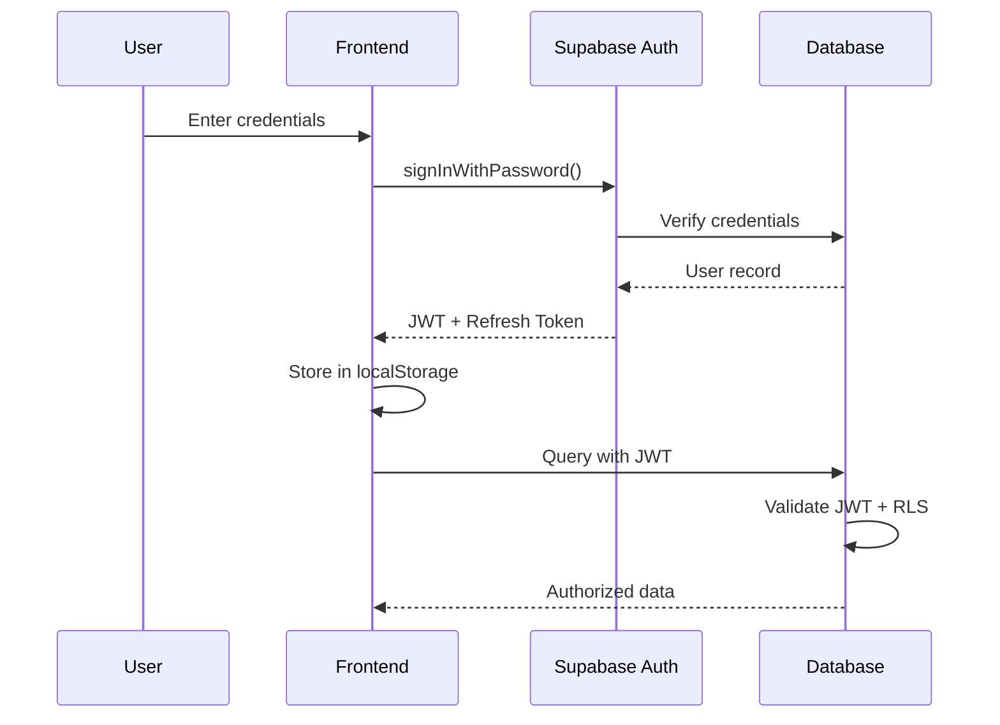

# AutoRepAi Security Program

## Overview

AutoRepAi implements defense-in-depth security controls aligned with **OWASP ASVS v5** and industry best practices for financial services software.

## Security Architecture

### Threat Model

**Assets:**
- Customer PII (names, emails, phone numbers, addresses)
- Financial data (credit applications, payment information)
- Vehicle inventory and pricing
- Business logic and trade secrets
- User credentials and session tokens

**Threat Actors:**
- External attackers (opportunistic, targeted)
- Malicious insiders
- Compromised third-party integrations
- Social engineering attacks

**Attack Vectors:**
- SQL injection
- XSS (Cross-Site Scripting)
- CSRF (Cross-Site Request Forgery)
- Authentication bypass
- Authorization flaws
- Session hijacking
- Data exfiltration
- Supply chain attacks

## OWASP ASVS v5 Control Mapping

**Detailed ASVS v5 Checklist**: See [docs/security/ASVS-Checklist.csv](./docs/security/ASVS-Checklist.csv) for complete pass/fail status of all 150+ controls with implementation notes and evidence locations.

### V1: Architecture, Design and Threat Modeling
| Control | Status | Implementation |
|---------|--------|----------------|
| V1.1.1 | ✅ | Secure SDLC with code review |
| V1.1.2 | ✅ | Threat model documented (this file) |
| V1.4.1 | ✅ | Trusted enforcement points (RLS) |
| V1.5.1 | ✅ | Input validation at boundaries |

### V2: Authentication
| Control | Status | Implementation |
|---------|--------|----------------|
| V2.1.1 | ✅ | Password-based authentication (Supabase) |
| V2.1.2 | ✅ | Email verification supported |
| V2.2.1 | ✅ | Strong password requirements |
| V2.2.3 | ✅ | Password reset with email confirmation |
| V2.3.1 | ✅ | Session management via Supabase Auth |
| V2.7.1 | ✅ | Logout terminates session |
| V2.8.1 | ⏳ | MFA/2FA support (planned) |

**Implementation Notes:**
- Supabase Auth handles password hashing (bcrypt)
- JWT tokens with expiry (1 hour default)
- Auto token refresh on activity
- Session stored in localStorage (httpOnly not applicable to JWT pattern)

### V3: Session Management
| Control | Status | Implementation |
|---------|--------|----------------|
| V3.2.1 | ✅ | Session tokens cryptographically random |
| V3.2.2 | ✅ | Session ID not in URL |
| V3.3.1 | ✅ | Logout invalidates session |
| V3.3.2 | ✅ | Session timeout after inactivity |
| V3.4.1 | ✅ | Cookie-based sessions (JWT in Auth header) |

**Implementation Notes:**
- JWT tokens signed with HS256
- Refresh token rotation on use
- Concurrent session limit: unlimited (can be restricted via custom logic)

### V4: Access Control
| Control | Status | Implementation |
|---------|--------|----------------|
| V4.1.1 | ✅ | Deny by default (RLS) |
| V4.1.2 | ✅ | User data isolation (org/dealer scoped) |
| V4.1.3 | ✅ | RBAC with user_roles table |
| V4.1.5 | ✅ | Access control enforced server-side |
| V4.2.1 | ✅ | Sensitive data access via secure channels |

**Implementation Notes:**
- Row Level Security (RLS) on all tables
- Security definer functions to prevent recursion
- Organization-scoped queries
- Role hierarchy: super_admin > org_admin > dealer_admin > sales_manager > sales_rep > finance_manager > viewer

### V5: Input Validation
| Control | Status | Implementation |
|---------|--------|----------------|
| V5.1.1 | ✅ | Input validation at boundaries (Zod) |
| V5.1.2 | ✅ | Structured data validation |
| V5.1.3 | ✅ | Output encoding (React escaping) |
| V5.1.4 | ✅ | Character set validation (UTF-8) |
| V5.2.1 | ✅ | Sanitized against injection |
| V5.3.1 | ✅ | XSS protection (React, CSP planned) |

**Implementation Notes:**
- Zod schemas for all form inputs
- Supabase client uses parameterized queries (no raw SQL)
- React's automatic escaping prevents XSS
- Length limits enforced on all text inputs

### V6: Cryptography
| Control | Status | Implementation |
|---------|--------|----------------|
| V6.2.1 | ✅ | TLS 1.2+ for all connections |
| V6.2.2 | ✅ | Strong cipher suites |
| V6.2.5 | ✅ | Certificate validation |
| V6.3.1 | ⏳ | Encryption at rest (Supabase managed) |
| V6.3.2 | ⏳ | E2EE for sensitive files (planned) |
| V6.4.1 | ⏳ | Random number generation (WebCrypto) |

**Planned E2EE Implementation:**
```typescript
// Client-side (WebCrypto AES-GCM)
const key = await window.crypto.subtle.generateKey(
  { name: "AES-GCM", length: 256 },
  true,
  ["encrypt", "decrypt"]
);

const iv = window.crypto.getRandomValues(new Uint8Array(12));
const encrypted = await window.crypto.subtle.encrypt(
  { name: "AES-GCM", iv },
  key,
  data
);

// Server-side (libsodium sealed boxes)
// TODO: Implement envelope encryption for key exchange
```

### V7: Error Handling and Logging
| Control | Status | Implementation |
|---------|--------|----------------|
| V7.1.1 | ✅ | Generic error messages to users |
| V7.1.2 | ✅ | Detailed logs server-side |
| V7.2.1 | ✅ | Sensitive data not in logs |
| V7.3.1 | ✅ | Audit logs for security events |
| V7.4.1 | ✅ | Error handling doesn't leak info |

**Logging Implementation:**
- Edge function logs in Supabase dashboard
- Audit events table (append-only)
- No passwords or tokens in logs
- Error messages sanitized for client

### V8: Data Protection
| Control | Status | Implementation |
|---------|--------|----------------|
| V8.1.1 | ✅ | Sensitive data identified |
| V8.1.2 | ✅ | PII handling procedures |
| V8.2.1 | ✅ | Data at rest encryption (Supabase) |
| V8.2.2 | ✅ | Data in transit encryption (TLS) |
| V8.3.1 | ✅ | Sensitive data not in URL |
| V8.3.4 | ✅ | Auto-complete disabled on sensitive fields |

**Sensitive Data Classification:**
- **Critical**: Credit card numbers, SSN, passwords
- **High**: Credit scores, financial data, driver's license
- **Medium**: Contact information, vehicle preferences
- **Low**: Public information, system metadata

### V9: Communication
| Control | Status | Implementation |
|---------|--------|----------------|
| V9.1.1 | ✅ | TLS for all connections |
| V9.1.2 | ✅ | HTTPS enforced |
| V9.2.1 | ✅ | Strong TLS configuration |
| V9.2.3 | ✅ | Certificate validation |

### V10: Malicious Code
| Control | Status | Implementation |
|---------|--------|----------------|
| V10.2.1 | ✅ | CSP headers (planned) |
| V10.3.1 | ✅ | Dependencies audited (npm audit) |
| V10.3.2 | ✅ | SRI for CDN resources (planned) |

### V11: Business Logic
| Control | Status | Implementation |
|---------|--------|----------------|
| V11.1.1 | ✅ | Sequential flow controls |
| V11.1.2 | ✅ | Rate limiting on AI calls |
| V11.1.4 | ✅ | Transaction rollback support |

### V12: Files and Resources
| Control | Status | Implementation |
|---------|--------|----------------|
| V12.1.1 | ⏳ | File type validation (planned) |
| V12.1.2 | ⏳ | File size limits (planned) |
| V12.2.1 | ⏳ | Malware scanning (planned) |
| V12.4.1 | ⏳ | File storage security (Supabase Storage) |

### V13: API and Web Service
| Control | Status | Implementation |
|---------|--------|----------------|
| V13.1.1 | ✅ | RESTful API design |
| V13.1.2 | ✅ | Authentication required |
| V13.2.1 | ✅ | CORS configured |
| V13.2.2 | ✅ | HTTP methods restricted |
| V13.3.1 | ✅ | API rate limiting |

### V14: Configuration
| Control | Status | Implementation |
|---------|--------|----------------|
| V14.1.1 | ✅ | Secure build pipeline |
| V14.1.2 | ✅ | Dependencies up to date |
| V14.2.1 | ✅ | Security headers (planned CSP) |
| V14.3.1 | ✅ | Secrets in environment variables |
| V14.4.1 | ✅ | HTTP security headers |

## Security Headers

### Implemented (via Supabase Edge Functions)
```typescript
const securityHeaders = {
  'X-Content-Type-Options': 'nosniff',
  'X-Frame-Options': 'DENY',
  'X-XSS-Protection': '1; mode=block',
  'Referrer-Policy': 'strict-origin-when-cross-origin',
};
```

### Planned (CSP)
```
Content-Security-Policy: 
  default-src 'self';
  script-src 'self' 'unsafe-inline' https://ai.gateway.lovable.dev;
  style-src 'self' 'unsafe-inline';
  img-src 'self' data: https:;
  connect-src 'self' https://niorocndzcflrwdrofsp.supabase.co https://ai.gateway.lovable.dev;
  font-src 'self';
  frame-ancestors 'none';
  base-uri 'self';
  form-action 'self';
```

## Encryption Implementation

### End-to-End Encryption (E2EE) - Planned

#### Client-Side (WebCrypto AES-GCM)
```typescript
// src/lib/crypto.ts
export async function encryptFile(file: File): Promise<{
  encrypted: ArrayBuffer;
  key: string; // base64-encoded
  iv: string; // base64-encoded
}> {
  const key = await window.crypto.subtle.generateKey(
    { name: "AES-GCM", length: 256 },
    true,
    ["encrypt", "decrypt"]
  );

  const iv = window.crypto.getRandomValues(new Uint8Array(12));
  const fileBuffer = await file.arrayBuffer();

  const encrypted = await window.crypto.subtle.encrypt(
    { name: "AES-GCM", iv },
    key,
    fileBuffer
  );

  const exportedKey = await window.crypto.subtle.exportKey("raw", key);

  return {
    encrypted,
    key: arrayBufferToBase64(exportedKey),
    iv: arrayBufferToBase64(iv),
  };
}

export async function decryptFile(
  encrypted: ArrayBuffer,
  keyBase64: string,
  ivBase64: string
): Promise<ArrayBuffer> {
  const keyBuffer = base64ToArrayBuffer(keyBase64);
  const iv = base64ToArrayBuffer(ivBase64);

  const key = await window.crypto.subtle.importKey(
    "raw",
    keyBuffer,
    "AES-GCM",
    false,
    ["decrypt"]
  );

  return await window.crypto.subtle.decrypt(
    { name: "AES-GCM", iv },
    key,
    encrypted
  );
}
```

#### Server-Side (Envelope Encryption) - Planned
```typescript
// supabase/functions/encrypt-key/index.ts
import { crypto_box_seal, crypto_box_seal_open } from 'https://deno.land/x/sodium/mod.ts';

// Master public key stored in environment
const MASTER_PUBLIC_KEY = Deno.env.get('MASTER_PUBLIC_KEY');

export async function sealKey(dataKey: Uint8Array): Promise<Uint8Array> {
  return crypto_box_seal(dataKey, base64ToUint8Array(MASTER_PUBLIC_KEY));
}
```

### Key Management - Planned
- **Data Encryption Keys (DEK)**: Generated per file, encrypted with KEK
- **Key Encryption Keys (KEK)**: Managed via environment variables
- **Key Rotation**: Quarterly rotation policy
- **Key Revocation**: Immediate on security incident

## Authentication & Authorization

### Authentication Flow


### RLS Policy Example
```sql
-- Users can only view leads in their organization
CREATE POLICY "org_scoped_select" ON leads
FOR SELECT
USING (
  dealership_id IN (
    SELECT id FROM dealerships 
    WHERE organization_id = get_user_organization(auth.uid())
  )
);
```

## Secret Management

### Supabase Secrets
Managed via Supabase dashboard at:
`https://supabase.com/dashboard/project/niorocndzcflrwdrofsp/settings/functions`

**Current Secrets:**
- `LOVABLE_API_KEY` - AI gateway authentication
- `SUPABASE_SERVICE_ROLE_KEY` - Admin operations
- `SUPABASE_DB_URL` - Database connection

**Required (Production):**
- `RESEND_API_KEY` - Email service
- `TWILIO_AUTH_TOKEN` - SMS service
- `STRIPE_SECRET_KEY` - Payment processing (if applicable)
- `MASTER_PUBLIC_KEY` - E2EE envelope encryption
- `MASTER_PRIVATE_KEY` - E2EE envelope decryption

### Secret Rotation Policy
- **Critical Secrets**: Rotate every 90 days
- **API Keys**: Rotate on team member departure
- **Database Credentials**: Rotate annually
- **Emergency Rotation**: Within 24 hours of suspected compromise

## Vulnerability Management

### Dependency Scanning
```bash
# Run regularly
npm audit
npm audit fix
```

### Security Testing Schedule
- **Static Analysis**: Every commit (planned)
- **Dependency Scanning**: Weekly
- **Penetration Testing**: Quarterly (external)
- **Security Code Review**: All PRs

### Known Vulnerabilities
- Monitor [GitHub Security Advisories](https://github.com/advisories)
- Subscribe to [Supabase Security Announcements](https://supabase.com/docs/guides/platform/going-into-prod#security)

## Incident Response

### Security Incident Classification

**P0 - Critical (< 1 hour response)**
- Data breach affecting PII
- Authentication bypass
- Ransomware/malware infection
- Complete service outage

**P1 - High (< 4 hours response)**
- Unauthorized access attempt
- SQL injection vulnerability
- XSS vulnerability
- Partial service degradation

**P2 - Medium (< 24 hours response)**
- Minor security misconfiguration
- Suspicious activity detected
- Non-critical vulnerability

**P3 - Low (< 1 week response)**
- Security enhancement suggestions
- Compliance findings

### Incident Response Playbook

#### 1. Detection & Triage (0-15 min)
- [ ] Identify incident type and severity
- [ ] Assign incident commander
- [ ] Open incident ticket
- [ ] Start incident timeline documentation

#### 2. Containment (15 min - 1 hour)
- [ ] Isolate affected systems (revoke credentials, disable features)
- [ ] Preserve evidence (logs, snapshots)
- [ ] Notify stakeholders
- [ ] Implement temporary mitigations

#### 3. Investigation (1-4 hours)
- [ ] Analyze logs and audit trails
- [ ] Identify root cause
- [ ] Assess impact and scope
- [ ] Document findings

#### 4. Eradication (4-8 hours)
- [ ] Remove threat (malware, backdoors, compromised accounts)
- [ ] Patch vulnerabilities
- [ ] Reset credentials
- [ ] Verify threat removal

#### 5. Recovery (8-24 hours)
- [ ] Restore services gradually
- [ ] Monitor for recurrence
- [ ] Verify system integrity
- [ ] Resume normal operations

#### 6. Post-Incident (24-48 hours)
- [ ] Conduct post-mortem
- [ ] Document lessons learned
- [ ] Update security controls
- [ ] Notify affected parties (if required)
- [ ] File regulatory reports (if required)

### Breach Notification Requirements

**Canada (PIPEDA):**
- Notify Privacy Commissioner if real risk of significant harm
- Notify affected individuals if real risk of significant harm
- Timeline: As soon as feasible

**Quebec (Law-25):**
- Notify CAI within 72 hours
- Notify individuals if serious harm risk
- Maintain breach registry

**US (State-specific):**
- Varies by state (typically 30-90 days)
- Attorney General notification for large breaches

**EU (GDPR):**
- Notify DPA within 72 hours
- Notify individuals if high risk
- Document all breaches

## Security Contacts

### Internal
- **Security Lead**: [To be assigned]
- **Incident Commander**: [To be assigned]
- **Privacy Officer**: [To be assigned]

### External
- **Supabase Support**: support@supabase.io
- **Penetration Testing**: [Vendor TBD]
- **Cyber Insurance**: [Policy TBD]

## Compliance Audit Checklist

### Pre-Audit
- [ ] Review access logs (30 days)
- [ ] Export audit events
- [ ] Document RLS policies
- [ ] Verify encryption settings
- [ ] Check secret rotation dates
- [ ] Review dependency vulnerabilities
- [ ] Test backup restoration
- [ ] Verify consent logs integrity

### During Audit
- [ ] Provide read-only database access (if requested)
- [ ] Share architecture diagrams
- [ ] Demonstrate access controls
- [ ] Show incident response procedures
- [ ] Present training records

### Post-Audit
- [ ] Address all findings within SLA
- [ ] Update documentation
- [ ] Implement recommended controls
- [ ] Schedule re-audit if required

## Security Training

### Required Training
- **All Employees**:
  - Security awareness (annual)
  - Phishing simulation (quarterly)
  - Password management
  - Incident reporting

- **Developers**:
  - Secure coding practices
  - OWASP Top 10
  - SQL injection prevention
  - XSS prevention

- **Sales Team**:
  - CASL/TCPA compliance
  - Consent management
  - Data protection basics

- **Finance Team**:
  - FCRA requirements
  - GLBA safeguards
  - Credit data handling

## Security Metrics

### KPIs
- Failed login attempts (threshold: < 100/day)
- Unauthorized access attempts (threshold: 0)
- Mean time to detect (MTTD): < 15 minutes
- Mean time to respond (MTTR): < 1 hour (P0)
- Vulnerability remediation time: < 7 days (High), < 30 days (Medium)
- Secrets rotation compliance: 100%
- Staff training completion: 100%

### Monthly Security Report
- Total security incidents
- Vulnerability scan results
- Penetration test findings
- Access review completion
- Training completion rate
- Compliance status

## Version History

- **v1.0 (2025-10-01)**: Initial security program
  - ASVS v5 mapping
  - RLS implementation
  - Audit logging
  - Incident response procedures
  - Encryption architecture (planned)

## Continuous Improvement

Security is an ongoing process. This document should be reviewed and updated:
- Quarterly by security team
- After each security incident
- When new threats emerge
- When regulations change
- Before external audits
